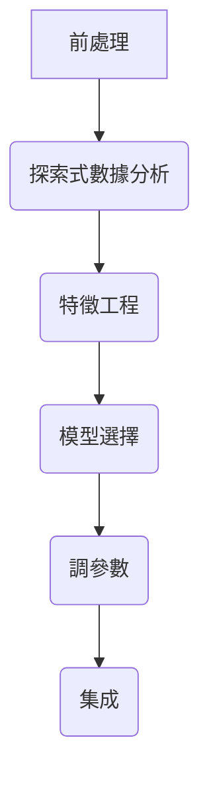
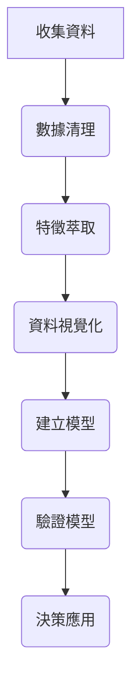

### note

```c
for i in {5..107}
do
   echo "Welcome $i times"
   mkdir day$i
done
```

# ML introduction Map

### 監督式學習


### 非監督式學習
- 分群
- 降維

###EDA？

#### 初步透過視覺化/統計工具進行分析，達到三個主要目的
- 了解資料：獲取資料所包含的資訊、結構和特點 
- 發現 outliers 或異常數值：檢查資料是否有誤
- 分析各變數間的關聯性：找出重要的變數
- 從 EDA 的過程中觀察現象，檢查資料是否符合分析前的假設

### 數據分析的流程


## day05
### 前處理(Processing)

#### dataframe(.csv) - 需要把分析過程中所產生的數據或者結果儲存為結構化的資料


- 在資料量很大時，可以先在和資料具有同樣結構的小樣本驗證程式碼執行的結果是否符合預期
- 用 pd.DataFrame 來創建一個 dataframe
- 用 np.random.randint 來產生隨機數值

#### image,text

```python
Import cv2

image = cv2.imread(...) # 注意 cv2 會以 BGR 讀入

image = cv2.cvtcolor(image, cv2.COLOR_BGR2RGB)


from PIL import Image

image = Image.read(...)

import skimage.io as skio

image = skio.imread(...)


#Python npy
#讀取範例：

import numpy as np

arr = np.load(example.npy)

#Pickle (pkl)
#讀取範例：

import pickle

with open(‘example.pkl’, ‘rb’) as f:

arr = pickle.load(f)

```

#### 不同的資料有不同讀取方式

- 文字格式：通常可以用 with open()
- 圖像格式：可以使用 PIL, Skimage 或是 CV2 (CV2 的速度較快，但須注意讀入的格式為 BGR)
- 其他形式如 npy / pickle 可以儲存經過處理後的資料